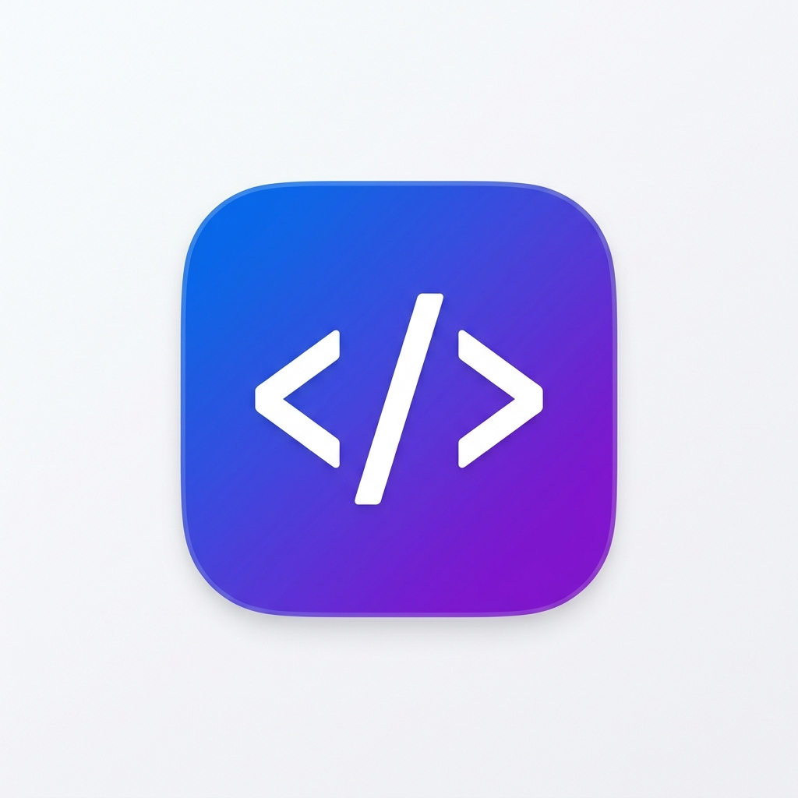

<div align="center">
  

  <h1>AI Code Explainer</h1>

  <p>Your AI-powered programming teacher and automated debugger, in one dashboard.</p>

  <p>
    <a href="#overview">Overview</a> •
    <a href="#key-features">Key Features</a> •
    <a href="#tech-stack">Tech Stack</a> •
    <a href="#installation">Installation</a> •
    <a href="#usage">Usage</a> •
    <a href="#screenshots">Screenshots</a> •
    <a href="#architecture">Architecture</a>
  </p>

  <p>
    
    
    
    
    
    
    
  </p>
</div>

---

## Overview

AI Code Explainer is a dual-pane web application acting as both a programming teacher and an automated debugger. Simply paste your code, select a language, and receive an instant, beginner-friendly breakdown alongside critical bug fixes. The platform currently supports Python, JavaScript, TypeScript, JSX, TSX, CSS, Java, C, and C++.

## Key Features

### Advanced Code Editor
- **Real-time Syntax Highlighting:** Powered by Prism.js for accurate highlighting across all 9 supported languages.
- **Precision Line Tracking:** A synchronized scroll gutter keeps line numbers locked perfectly, even for massive files.
- **Language Validation:** Mandatory language selection ensures the AI understands the precise context before analysis begins.

### AI Analysis Dashboard
- **Unified Teacher + Debugger Mode:** Explains the intent of the code while hunting for syntax errors and edge cases simultaneously.
- **Corrected Code Blocks:** Delivers fully formatted, copy-pasteable blocks of corrected code when bugs are found.
- **Line-by-Line Breakdown:** A structured data table that dissects the logic line-by-line, placing explanations directly next to code snippets.
- **Output Prediction:** Simulates execution to predict what the script will print or return.

### Visual & Interactive Tools
- **Mermaid Flowcharts:** Automatically generates dynamic, visual logic flowcharts using Mermaid.js.
- **Step Debugger:** An interactive interface to step forward and backward through code execution while watching variables change.
- **Complexity Analysis:** Instantly surfaces the Big-O time and space complexity of your algorithms.

### Premium UX
- **Glassmorphism Design:** Beautiful dark and light theming using native CSS variables and glassmorphic overlays.
- **Micro-Interactions:** Smooth Framer Motion transitions and toast notifications guide the user experience.

## Tech Stack

| Category | Technology | Description |
| --- | --- | --- |
| **Frontend** | React 19 + Vite | Fast, modern rendering engine and dev server. |
| **Language** | TypeScript | Strict typing for reliability across the entire codebase. |
| **Styling** | Pure CSS | Native CSS variables for scalable dark/light theming. |
| **Layout** | `react-resizable-panels` | Draggable split-pane layout for desktop; stacked on mobile. |
| **AI Backend** | API Layer | Integrates Gemini / OpenAI / OpenRouter. |
| **Animation** | `motion/react` | Handles staggered ghost cards, layout shifts, and micro-interactions. |
| **Diagrams** | `mermaid.js` | Renders the logic flowcharts. |
| **Syntax** | `Prism.js` | Drives the editor's live highlighting. |

## Installation

```bash
# Clone the repository
git clone https://github.com/vigneshselvanV/ai-code-explainer.git

# Navigate into the directory
cd ai-code-explainer

# Install dependencies
npm install

# Start the development server
npm run dev
```

### Environment Variables
You will need to configure your LLM provider API keys. Create a `.env` file in the project root:

```env
VITE_GEMINI_API_KEY=your_gemini_key_here
VITE_OPENAI_API_KEY=your_openai_key_here
```

## Usage

1. **Paste Code:** Drop your raw code into the left editor pane.
2. **Select Language:** Choose the correct language from the dropdown (required).
3. **Analyze:** Click the "Analyze Code" button.
4. **Review:** Explore the generated dashboard, including the overview, bug fixes, line-by-line breakdown, visual flowchart, interactive step debugger, and complexity analysis.

## Screenshots

<!-- TODO: Add actual image paths for screenshots -->

*The dual-pane editor view featuring glassmorphism and strict syntax highlighting.*


*The unified Teacher + Debugger dashboard displaying corrected code and line-by-line breakdowns.*


*Auto-generated Mermaid.js logic flowcharts.*

## Architecture

The application relies on a split-pane resizable layout to maximize reading comprehension without context switching. The entire frontend is strictly typed using TypeScript, which is critical because it enforces a structured JSON contract between the React interface and the LLM API layer. By forcing the LLM to return a strict JSON schema rather than raw markdown, the frontend can predictably parse the response into distinct, interactive UI components (like the step debugger and line-by-line table) instead of dumping a wall of text onto the screen.

## Target Audience

Designed for students and beginners learning new programming languages, as well as professional developers looking to rapidly debug legacy code, generate documentation, or analyze algorithmic complexity.

---

**License:** MIT <!-- TODO: Confirm if MIT license is correct -->  
**Built by:** [Vignesh Selvan](https://github.com/vigneshselvanV)