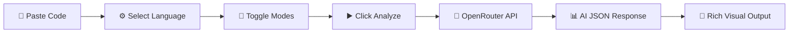

<div align="center">

# 🧠 AI Code Explainer

### **Your Intelligent Coding Tutor & Visual Debugger**

[](https://www.typescriptlang.org/)
[](https://react.dev/)
[](https://vitejs.dev/)
[](https://tailwindcss.com/)
[](LICENSE)

<br/>

*A modern, AI-powered web application that analyzes, explains, and visually debugs code — designed for learners, educators, and developers who want to understand code at a deeper level.*

<br/>

[🚀 Getting Started](#-getting-started) · [✨ Features](#-features) · [🛠 Tech Stack](#-tech-stack) · [📁 Project Structure](#-project-structure) · [🤝 Contributing](#-contributing)

---

</div>

## ✨ Features

### 🔍 Intelligent Code Analysis
Paste your code and let AI break it down with a comprehensive analysis — from a high-level program overview to granular, line-by-line explanations.

### 📊 Visual Execution Flowcharts
Automatically generates **Mermaid.js** flowchart diagrams that visually map out your code's execution path, control flow, loops, and conditionals.

### 🐞 Smart Bug Detection & Debugging
Toggle **Debug Mode** to detect syntax errors, logical bugs, and potential runtime issues. Get corrected code with detailed fix explanations.

### 🧑‍🏫 Teach Me Mode
Enable **Teach Me Mode** for beginner-friendly explanations enriched with emojis, examples, and step-by-step teaching style — perfect for students and self-learners.

### ⏯️ Step-by-Step Visual Debugger
Walk through your code execution step-by-step with an interactive debugger that shows:
- **Line-by-line code highlighting** — see exactly which line is executing
- **Variable memory state tracking** — watch variables change in real time
- **Play/Pause/Step controls** — debug at your own pace

### ⚡ Complexity Analysis
Understand the performance characteristics of your code with detailed **time complexity** and **space complexity** breakdowns.

### 🌐 Multi-Language Support
Analyze code in multiple programming languages with full syntax highlighting:

| Language | Status |
|----------|--------|
| Python | ✅ Supported |
| JavaScript | ✅ Supported |
| TypeScript | ✅ Supported |
| Java | ✅ Supported |
| C | ✅ Supported |
| C++ | ✅ Supported |

### 🎨 Premium UI/UX
- **Dark & Light themes** with smooth animated transitions
- **Glassmorphism** design with floating gradient backgrounds
- **Resizable panels** — customize your workspace layout
- **Typewriter effects** for engaging explanation reveal
- **Custom syntax highlighting** with PrismJS

### 📜 Session History
Automatically saves all your analysis sessions to local storage. Browse, revisit, and reload past code explanations from the collapsible history sidebar.

### 🔐 User Authentication
Built-in login/signup modal with clean UI for user session management.

---

## 🖼️ Screenshots

> 💡 *Run the app locally and take screenshots to add here!*

```
📸 Add screenshots by placing images in a /screenshots folder:


```

---

## 🛠 Tech Stack

<div align="center">

| Category | Technology |
|:---------|:-----------|
| **Frontend Framework** | React 19 |
| **Language** | TypeScript |
| **Build Tool** | Vite 6 |
| **Styling** | Tailwind CSS 4 |
| **Animations** | Framer Motion (motion) |
| **Code Editor** | react-simple-code-editor |
| **Syntax Highlighting** | PrismJS |
| **Flowcharts** | Mermaid.js |
| **Icons** | Lucide React |
| **Layout** | react-resizable-panels |
| **AI Provider** | OpenRouter API (GPT-4o Mini) |
| **Fonts** | Inter + JetBrains Mono |

</div>

---

## 🚀 Getting Started

### Prerequisites

- **Node.js** ≥ 18.x
- **npm** ≥ 9.x
- An **OpenRouter API Key** ([Get one here](https://openrouter.ai/))

### Installation

1. **Clone the repository**

   ```bash
   git clone https://github.com/vigneshselvanV/ai-code-explainer.git
   cd ai-code-explainer
   ```

2. **Install dependencies**

   ```bash
   npm install
   ```

3. **Configure environment variables**

   Create a `.env` file in the project root:

   ```env
   OPENROUTER_API_KEY=your_openrouter_api_key_here
   ```

   > ⚠️ **Never commit your `.env` file.** It is already included in `.gitignore`.

4. **Start the development server**

   ```bash
   npm run dev
   ```

5. **Open your browser** and navigate to:

   ```
   http://localhost:3000
   ```

### Available Scripts

| Command | Description |
|---------|-------------|
| `npm run dev` | Start dev server on port 3000 |
| `npm run build` | Build for production |
| `npm run preview` | Preview production build |
| `npm run clean` | Remove dist folder |
| `npm run lint` | Run TypeScript type checking |

---

## 📁 Project Structure

```
ai-code-explainer/
├── index.html              # HTML entry point
├── package.json            # Dependencies & scripts
├── tsconfig.json           # TypeScript configuration
├── vite.config.ts          # Vite build configuration
├── metadata.json           # App metadata
├── .env                    # Environment variables (not tracked)
├── .gitignore              # Git ignore rules
│
├── src/
│   ├── main.tsx            # React DOM render entry
│   ├── App.tsx             # Main application component
│   │   ├── MermaidDiagram  # Flowchart rendering component
│   │   ├── AuthModal       # Login/Signup modal
│   │   ├── StepDebugger    # Interactive step-by-step debugger
│   │   ├── ExplanationView # AI explanation display
│   │   ├── Typewriter      # Typing animation effect
│   │   └── CopyButton      # Clipboard copy utility
│   └── index.css           # Global styles, themes & design tokens
│
└── dist/                   # Production build output
```

---

## 🔧 How It Works



1. **Input** — Paste your code into the built-in editor with syntax highlighting
2. **Configure** — Select language and toggle Debug/Teach Me modes
3. **Analyze** — The app sends your code to the OpenRouter API (GPT-4o Mini)
4. **Output** — Receive a structured JSON response rendered as:
   - 📘 Program Overview
   - 🔍 Line-by-Line Explanation
   - 📊 Expected Output
   - 🧠 Key Concepts
   - ⚡ Time & Space Complexity
   - ⏯️ Interactive Step Debugger
   - 🛠️ Execution Flowchart
   - 🐞 Bug Fixes (when Debug Mode is ON)

---

## 🤝 Contributing

Contributions are welcome! Here's how you can help:

1. **Fork** the repository
2. **Create** a feature branch
   ```bash
   git checkout -b feature/amazing-feature
   ```
3. **Commit** your changes
   ```bash
   git commit -m "feat: add amazing feature"
   ```
4. **Push** to the branch
   ```bash
   git push origin feature/amazing-feature
   ```
5. **Open** a Pull Request

### Contribution Guidelines

- Follow the existing code style and conventions
- Write meaningful commit messages using [Conventional Commits](https://www.conventionalcommits.org/)
- Test your changes thoroughly before submitting a PR
- Update documentation if your changes affect the user experience

---

## 📄 License

This project is licensed under the **MIT License** — see the [LICENSE](LICENSE) file for details.

---

## 🙏 Acknowledgments

- [OpenRouter](https://openrouter.ai/) — AI model routing & API access
- [React](https://react.dev/) — UI library
- [Vite](https://vitejs.dev/) — Next-gen frontend tooling
- [Mermaid.js](https://mermaid.js.org/) — Diagram & flowchart rendering
- [PrismJS](https://prismjs.com/) — Syntax highlighting
- [Lucide](https://lucide.dev/) — Beautiful icon library
- [Framer Motion](https://www.framer.com/motion/) — Animation library

---

<div align="center">

**Built with ❤️ by [Vignesh Selvan](https://github.com/vigneshselvanV)**

⭐ Star this repo if you found it helpful!

</div>